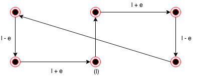
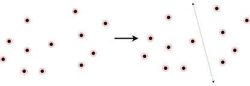
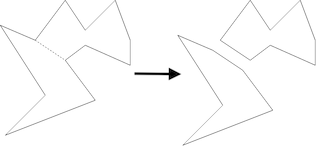

Designing good algorithms for real-world problems requires the use of techniques (data structures, dynamic programming, backtracking, heuristics, modeling) and resources (other implementations that already exist and can be referenced to as a basis).

Collected implementations of algorithms can be found at http://www.cs.sunysb.ed/~algorith (though that redirects you to [this website](http://www.algorist.com/algorist.html)

Links to example problems can be found at ~~programming - challenges . com~~ - nope, that doesn't exist anymore. He also mentions online-judge.vva.es. Finally found uva.onlinejudge.org which has the problems he mentions in Chapter 1 under the right numbers, but the website is kind of horrendously slow. Still, [this](https://uva.onlinejudge.org/index.php?option=com_onlinejudge&Itemid=8&category=1) should get you to any of the questions you're looking for.

## Chapter 1: Introduction to Algorithm Design

**Algorithms** are procedures for solving geernal, well-specified, problems. These problems are specified by describing the list of instances it is designed to work on and what the resulting output of each instance should be. It is a procedure to take any of the possible input instances and transform it into the desired output.

An **instance** is a specific use case for a problem with a specific input in order to determine its output from the problem

**Insertion sort** is a method for sorting a list/array of values by starting with a single element and iterating through the elements, swapping elements that are out of place

#### Three qualities of a good algorithm:

- Correct
- Efficient
- Easy to implement

### Problem: Robot Tour Optimization

**Input**: A set _S_ of _n_ points in the plane
**Output** What is the shortest cycle tour that visits each point in the set _S_?

#### Nearest Neighbor Psuedocode

```
NearestNeighbor(P)
    Pick and visit an initial point p₀ from P
    p = p₀
    i = 0
    While there are still unvisited points
        i = i + 1
        select pᵢ to be the closest unvisited point to pᵢ₋₁
        Visit pᵢ

    Return to p₀ from pⁿ₋₁ // Pretend that's a subscript n, it was fighting me
```

This does not work in situations where all points are along a line - might lead to jumping from left to right

#### ClosestPair Pseudocode

```
ClosestPair(P)
    Let n be the number of points in set P
    For i = 1 to n - 1 do
        d = ∞
        For each pair of endpoings(s, t) from distinct vertex chains
            if dist(s, t) ≤ d and then sᵐ = s, tᵐ = t, and d = dist(s, t)
        Connect (ᵐ, tᵐ) by an edge
    Connect the two endpoints by an edge
// Again, pretend that's a subscript m
```

This doesn't work if the data points are two rows of equally spaced points where the two rows are slightly closer than the dots in each row to each other


#### OptimalTSP(P)

```
d = ∞
For each of the n! permutations, Pᵢ of point set P
    If (cost(Pᵢ) ≤ d) then d = cost(Pᵢ) and P ᵐⁱⁿ = Pᵢ
Return Pᵐⁱⁿ

// The ᵐⁱⁿ should be subscript
```

This is accurate but very slow

#### Difference between algorithms and heuristics

Algorithms always produce a correct result.
Heuristics may usually do a good job, but do not provide a guarantee

### Problem: Moving Scheduling Problem

**Input**: A set _I_ of _n_ intervals on the line
**Output**: What is the largest subset of mutually non-overlapping intervals which can be selected from _I_?

#### Earliest Job First Pseudocode

```
EarliestJobFirst(I)
    Accept the earliest starting job j from I which does not overlap any previously accepted job and repeat until no such jobs remain
```

Taking one job may exclude 2, etc., so no guarantee that it will yield the largest subset

#### Shortest Job First Pseudocode

```
ShortestFirst(I)
    j = 0
    Sᵐᵃˣ = ∅
    For each of the 2ⁿ subsets, Sᵢ of intervals I
        If (Sᵢ is mutually non-overlapping) and (size (Sᵢ) > j)
            then j = size(Sᵢ) and Sᵐᵃˣ = Sᵢ
        Return Sᵐᵃˣ
// You guessed it, max should be subscript.  Hilariously, the n should not be
```

Gets all the possibilities, but isn't efficient when size of input gets larger

#### Optimal Scheduling Psuedocode

```
OptimalScheduling(I)
    While (I ≠ ∅) do
        Accept the job j from I with the earliest completion date
        Delete j and any interval which intersects j from I
```

∅ is a symbol for "empty set"

**Lesson**: Reasonable-looking algorithms can easily be incorrect. Algorithm correctness is a property that must be carefully demonstrated

### Mathematical Proof Characteristics

- Clear, precise statements of what you are trying to prove
- Set of assumptions of things which are taken to be true and hence used as part of the proof
- Chain of reasoning which takes you from these assumptions to the statement you are trying to prove
- ∎ QED to indicate finished "this is demonstrated"

Proofs are only useful when honest - brief and to the point arguments explaining why an algorithm satistifes a nontrivial correctness property

**Take Home**: The heart of any algorithm is an idea. If your idea is not clearly revealed when you express an algorithm, then you are using too low-level a notation to describe it

#### Problem specifications have two parts:

- Set of allowed input instances
- Required properties of the algorithm's output

**Take Home**: An important and honorable technique in algorithm design is to narrow the set of allowable instances until there is a correct and efficient algorithm. For example, we can restrict a graph problem from general graphs down to trees, or a geometric problem from two dimensions to one.

#### Common traps in specifying output requirements:

- Asking an ill-defined question
- Creating compound goals

### Counter-Examples - Instances which disprove an algorithm

Good counter-examples have two important properties:

- Verifiability
  - Calculate what answer the algorithm gives
  - Display/provide a better answer so as to prove the algorithm didn't find it
- Simplicity

### Techniques for coming up with counter-examples:

- Think small - when algorithms fail, there is usually a very simple example on which they fail
- Seek extremes
- Think exhaustively
- Hunt for the weakness
- Go for the tie (good way to break a greedy heuristic)

### Recursion

**Recursion** is mathematical induction - in both, have general and boundary conditions, with general condition breaking the problem into smaller pieces and the boundary condition terminating the recursion

One should be suspicious of inductive proofs because subtle reaoning errors can creep in:
First kind of error are boundary errors
Second are cavalier extension claims - adding an element could cause entire optimal solution to change

**Take Home**: Mathematical induction is usually the right way to verify the correctness of a recursive or incremental insertion algorithm

### Stop and Think: Incremental Correctness

**Problem**: Prove the correctness of the following recursive algorithm for incrementing natural numbers (i.e., y -> y + 1):

```
Increment(y)
    if (y = 0 then return (1) else
        if (y mod 2) = 1 then
            return (2 * Increment(⌊y/2⌋)
        else return (y + 1)
```

⌊⌋ are floor symbols. This threw me at first because I mistook them for absolute value symbols.

```
Increment(3)
    if (3 = 0 then return (1) else
        if (3 mod 2) = 1 then - nope
            return (2 * Increment([3/2]))

Increment(1)
    if (1 = 0 then return (1) else
        if (1 mod 2) = 1 then
            return (2 * Increment([1/2]))

Increment(0)
    if (0 = 0 then return (1)

// 2 * (2 * (1)) = 4
```

### Summations

Summation formulae are concise expressions describing the addition of an arbitrarily large set of numbers, in particular the formula


There are simple closed forms for summations of many algebraic functions. For example, since the sum of _n_ ones is _n_,


The sum of the first _n_ even integers can be seen by pairing up the *i*th and (_n-i_+1)th integers:


### Two basic classes of summation formaulae in algorithm analysis:

**Arithmetic progressions**
The arithmetic progression for selection sort is:


It's important that the sum is quadratic, not that the constant is 1/2. In general,


for *p*≥1. Thus, sum of squares is cubic and the sum of cubes is quartic.

Big theta (ϴ(_x_)) notation will be explained later in book.
For p < -1 the sum converges to a constant, even as n -> ∞

**Geometric progression**
In geometric progressions, the index of the loop affects the exponent, ie:


How we interpret the sum depends on the _base_ of the progression, i.e., _a_. When _a_ < 1 this converges to a constant even as n -> ∞

This series convergence proves to be the great "free lunch" of algorithm analysis. It means that the sum of a linear number of things can be constant, not linear. For example, 1 + 1/2 + 1/4 + 1/8+...≤ 2 no matter how many terms we add up.

When _a_ > 1, the sum grows rapidly with each new term, as in 1 + 2 + 4 + 8 + 16 + 32 = 63. Indeed,  for _a_ > 1

### Stop And Think: Factorial Formulae

**Problem**: Prove that &nbsp; &nbsp; 
Note: Formula in book actually had n at the top to the right of the sum and i = 1 on the bottom to the right of the sum, but further examples had it oriented this way

**Solution**: First verify the base case (here we do _n_ = 1, though _n_ = 0 could have been done:


Assume the statement is true up to _n_. To prove the general case of _n_ + 1, observer that rolling out the largest term


reveals the left side of our inductive assumption. Substituting the right side gives us


This general trick of separating out the largest term lies at the heart of all proofs.

### Modeling the Problem

**Modeling** is the the skill of taking your application and describing it in such a way that you can connect what problems you need to solve with the abstract algorithms you can use to solve them

#### Combinatorial Objects (Common Structures):

**Here is a list of common objects and the keywords to know to use them**
**Permutation**: Arrangements of items. Keywords: arrangement, tour, ordering, sequence
**Subsets**: Selections from a larger group of items. As order does not matter in subsets as they matter in permutations, permutations of subsets are considered identical. Keywords: cluster, collection, committee, group, packaging, selection
**Trees**: A structure used to represent hierarchical relationships between items. Keywords: dominance relationship, ancestor/descendant relationship, taxonomy, hierarchy
**Graphs**: Structures used to represent relationships between arbitrary pairs of objects. Keywords: network, circuit, web, relationship
**Points**: Represent locations in geometric space. Keywords: positions, sites, data records, locations
**Polygons**: Represent regions in geometric space, eg borders of a country can be described by a polygon on a map/plane. Keywords: regions, shapes, configurations, boundaries
**Strings**: Sequence of characters or patterns. Keywords: text, characters, patterns, labels

Recursive decompositions of combinatorial objects:

**Permutations**

{4, 1, 5, 2, 3} -> 4+{1, 4, 2, 3}

**Subsets**

{1, 2, 7, 9} -> 9+{1, 2, 7}

**Trees**


**Graphs**


**Point Sets**



**Polygons**



**Strings**

A L G O R I T H M -> A | L G O R I T H M

**Take Home**: Modeling your application in terms of well-defined structures and algorithms is the most important single step towards a solution

#### Recursive Objects

The key to recursive thinking is looking for things that are comprised of smaller things of the same type. All of the items in the combinatorial objects list could be thought about recursively.

**Permutations**: If you delete the first element of a permutation, you'll get a permutation of the remaining elements. Permutations are recursive objects.

**Subset**: Subsets contain subsets of even smaller subsets. Subsets are also recursive objects

**Trees**: If you delete the root of a tree, you'll get a collection of smaller trees. If you delete a leaf, you're left with a slightly smaller tree. Trees are recursive objects.

**Graphs** If you remove any edge or vertex from a graph, the resulting structure is still a graph. Graphs are recursive objects

**Points**: If you remove or separate points, you're still left with points. Points are recursive objects.

**Polygons**: Polygons are recursive because you can split them apart by adding chords between nonagent vertices and still end up with a polygon. The smallest simple polygon is a triangle

**Strings** If you add or remove characters of a string, you're still left with a string
